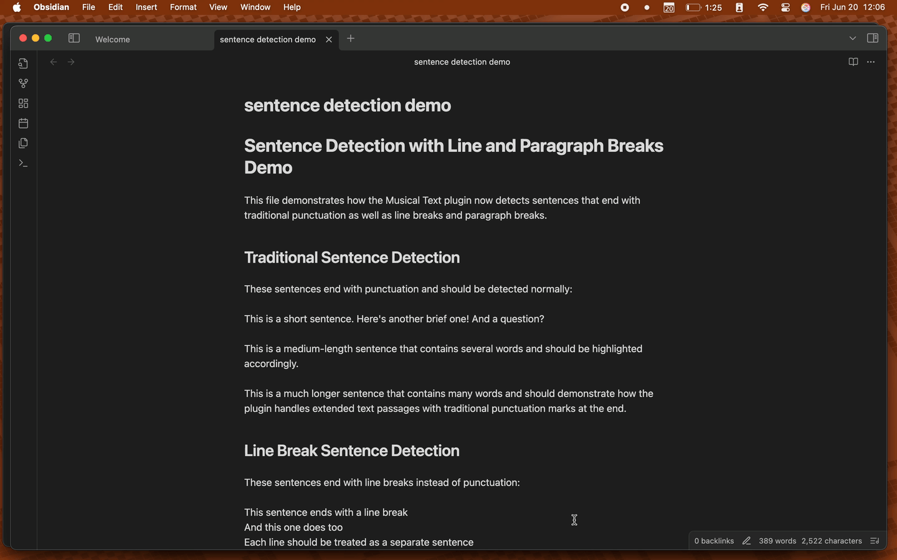

# Musical Text

Get immediate visual feedback about your sentence variety while writing in Obsidian. This plugin highlights sentences based on their length, helping you create more engaging and rhythmic prose.

## Features

- Real-time sentence highlighting as you type
- Color-coded visualization of sentence lengths:
  - Short sentences
  - Medium-length sentences
  - Long sentences
- Works only with visible text for better performance
- Toggle highlighting on/off with status bar button or command
- Customizable sentence length thresholds
- Customizable highlight colors

## How to Use

1. Install the plugin from Obsidian's Community Plugins
2. Enable the plugin in Settings → Community Plugins
3. Start writing! Sentences will be automatically highlighted based on their length
4. Toggle highlighting using:
   - The status bar button (highlighter icon)
   - The command palette (`Cmd/Ctrl + P` → "Toggle musical text highlighting")

## Configuration

You can customize the plugin in Settings → Musical Text:

- **Sentence Length Thresholds**
  - Short: 1-15 words (default)
  - Medium: 16-25 words (default)
  - Long: 26+ words (default)

- **Highlight Colors**
  - Customize colors for each sentence length category
  - Default colors provided for light and dark themes

## Why Use Musical Text?

Good writing has rhythm. Like music, prose benefits from variation in length and structure. This plugin helps you:

- Identify patterns in your writing
- Spot areas where sentence variety could be improved
- Develop a more natural writing flow

## About

Read about the development process in [my blog post](https://blog.tynanpurdy.com/2025/02/11/i-made-the-write-with.html).

## Support

- Report issues on [GitHub](link-to-your-repo)
- Follow development updates on [Bluesky](https://bsky.app/profile/tynanpurdy.com) or [Blog](https://blog.tynanpurdy.com)

## License

MIT License - see LICENSE file for details
